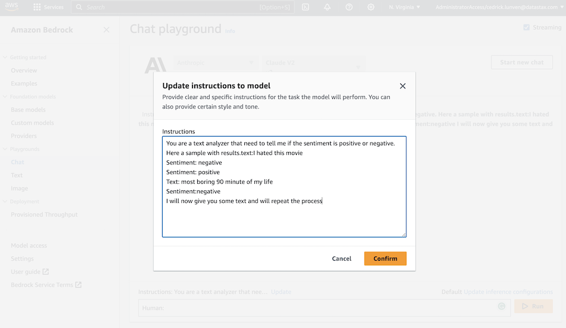

# Getting Started with Amazon BedRock and AstraDB

[](http://www.apache.org/licenses/LICENSE-2.0)
[](https://discord.com/widget?id=685554030159593522&theme=dark)

## 📋 Table of content


[**Part I - Amazon Bedrock**](#)
- [01. Chat Playground](#)
- [02. Prompt Engineering](#)
- [02. Prompt Templates](#)

[**Part II - Astra DB**](#)
- [01. Create Astra Account](#-1---create-your-datastax-astra-account)
- [02. Create Astra Token](#-2---create-an-astra-token)
- [03. Copy the token](#-3---copy-the-token-value-in-your-clipboard)
- [04. Open Gitpod](#-4---open-gitpod)
- [05. Setup CLI](#-5---set-up-the-cli-with-your-token)
- [06. Create Database](#-6---create-destination-database-and-a-keyspace)
- [07. Setup env variables](#-7---setup-env-variables)

[**Part II - Retrieval Augmented generation**](#)


<hr>

## HANDS ON

### Amazon Bedrock

Amazon Bedrock is a fully managed, fully serverless service offering access to
foundation models from various AI companies in a single API, together with
additional capabilities such as facilities for fine-tuning and agent frameworks.

Amazon Bedrock aims at simplifying development, especially for Generative AI,
while maintaining privacy and security. Experimenting with foundation models
is easy, and models can be further customized in a privacy-aware fashion
within Bedrock.

Foundation models from Amazon Bedrock can be easily **integrated with Astra DB**,
most notably with its Vector capabilities, thereby providing a solid framework for
developing Generative AI and other ML-centered applications.

In the following example, you will be able to run a standard RAG
(retrieval-augmented generation) application
that makes use of AI models from Amazon Bedrock and uses Astra DB as a Vector Store.

The integration is built with the LangChain framework, which conveniently offers
native support for Amazon Bedrock as well as Astra DB. Using LangChain is a popular
and well-established choice -- but certainly not the only one. See the references at
the end of the page for further options.


#### ✅ `1` - Chat Playground

- `1a` - Connect to your `AWS Management Consolee` and look for service `Amazon Bedrock`


- `1b` - On home page select getting started


- `1c` - In the left hand side menu pick `Chat`

- `1d` - Select model Provider and model

| Attribute | Value |
|-----------|-------|
| Provider  | Anthropic |
| Model     | Claude V2 |


- `1d` - In the prompt enter the question and click `run`

```console
human: Explain me what Datastax Astra Vector is
```


- `1e` - Above the prompt click `Update inference instruction` to check for a few options


#### ✅ `2` - Prompt Engineering

- `2a` - Start a new chat window with the `Start new chat`

- `2b` - In the instructions provide the following block

```
You are a text analyzer that need to tell me if the sentiment is positive or negative. Here a sample with results.text:I hated this movie
Sentiment: negative
Sentiment: positive
Text: most boring 90 minute of my life
Sentiment:negative
I will now give you some text and will repeat the process
```



- `2c` - Validate the instructions


### AstraDB

#### ✅ `1` - Create your DataStax Astra account

> ℹ️ Account creation tutorial is available in [awesome astra](https://awesome-astra.github.io/docs/pages/astra/create-account/)


_click the image below or go to [https://astra.datastax./com](bit.ly/3QxhO6t)_

<a href="bit.ly/3QxhO6t">

</a>
<br/>


#### ✅ `2` - Create an Astra Token

> ℹ️ Token creation tutorial is available in [awesome astra](https://awesome-astra.github.io/docs/pages/astra/create-token/#c-procedure)

- `Locate `Settings` (#1) in the menu on the left, then `Token Management` (#2)

- Select the role `Organization Administrator` before clicking `[Generate Token]`


The Token is in fact three separate strings: a `Client ID`, a `Client Secret` and the `token` proper. You will need some of these strings to access the database, depending on the type of access you plan. Although the Client ID, strictly speaking, is not a secret, you should regard this whole object as a secret and make sure not to share it inadvertently (e.g. committing it to a Git repository) as it grants access to your databases.

```json
{
  "ClientId": "ROkiiDZdvPOvHRSgoZtyAapp",
  "ClientSecret": "fakedfaked",
  "Token":"AstraCS:fake"
}
```

#### ✅ `3` - Copy the token value in your clipboard

You can also leave the windo open to copy the value in a second.

### Retrieval Augmented generation

## Prerequisites

To run the integration demo notebook, you need:

- An **Amazon account** with access to Amazon Bedrock and Amazon SageMaker Studio. In particular, you will be asked to provide a set of credentials for programmatic access (i.e. `AWS_ACCESS_KEY_ID`, `AWS_SECRET_ACCESS_KEY` and `AWS_SESSION_TOKEN`);
- Alternatively, if you run the notebook from within SageMaker Studio, it is sufficient to add the Bedrock policy to your SageMaker role instead of explicitly providing the above secrets. Please refer to [this link](https://github.com/aws-samples/amazon-bedrock-workshop#enable-aws-iam-permissions-for-bedrock) for details.
- An **Astra account** with a **Serverless Cassandra with Vector Search** database. You will need the [Database ID](https://awesome-astra.github.io/docs/pages/astra/faq/#where-should-i-find-a-database-identifier) and an [Access Token](https://awesome-astra.github.io/docs/pages/astra/create-token/) with role "Database Administrator".


## Run the example

The integration example is a Python 3.8+ runnable notebook. The **suggested method** is to import
the notebook in your **Amazon SageMaker Studio** and run it from there on a standardized environment,
which also makes the necessary AWS access credentials readily available.
_As a side note, however, the code can be executed on any environment able to run Python notebooks._

<p align="center">
    <a href="https://raw.githubusercontent.com/awesome-astra/docs/main/docs/pages/aiml/aws/notebooks/bedrock.ipynb" target="blank;">
        
    </a>
</p>

**Step 1.** Download the notebook from this repository at [this link](https://raw.githubusercontent.com/awesome-astra/docs/main/docs/pages/aiml/aws/notebooks/bedrock.ipynb) and save it to your local computer.
(You can also view it [on your browser](https://github.com/awesome-astra/docs/blob/main/docs/pages/aiml/aws/notebooks/bedrock.ipynb).)


**Step 2.** Open your Amazon SageMaker console and click the "Studio" item in the left navbar. _Do not choose "Studio Lab", which is a different thing._


**Step 3.** Click the "Open Studio" button after choosing a user profile: this will bring you to the Studio interface. _You may need to create a Studio instance ("SageMaker domain") if you don't have one already._


**Step 4.** In the left toolbox of Sagemaker Studio, make sure you select the "File Browser" view and locate the "Upload" button: use it to upload the notebook file you previously saved. The notebook will be shown in the file browser.


**Step 5.** If you double-click on it, the notebook will be opened in Studio. In order to run it, you will be asked to start a "notebook environment" (essentially, a Python runtime). Choose the "Data Science 3.0" image and a "Python 3" kernel and hit "Select".


**Step 6.** Once the kernel has fully started, you can run each cell in sequence by clicking on them and pressing Shift+Enter. You will be asked for the secrets during execution.


#### Cleanup

During the above steps, some resources are created, which you may want to
cleanly dispose of after you are done.

These have been stared to run the notebook itself. You can shut them down from within SageMaker Studio:
select the "Running Terminals and Kernels" view on the left toolbar (see picture below) and click the "shut down" icon next to all instances, apps and sessions associated to the notebook you just ran.


## Additional information

[More info on Amazon Bedrock](https://docs.aws.amazon.com/bedrock/latest/userguide/what-is-bedrock.html)

[Accessing Amazon Bedrock from Python](https://github.com/aws-samples/amazon-bedrock-samples/tree/main/introduction-to-bedrock)

[Using Astra DB for your Generative AI applications](https://awesome-astra.github.io/docs/pages/aiml/)