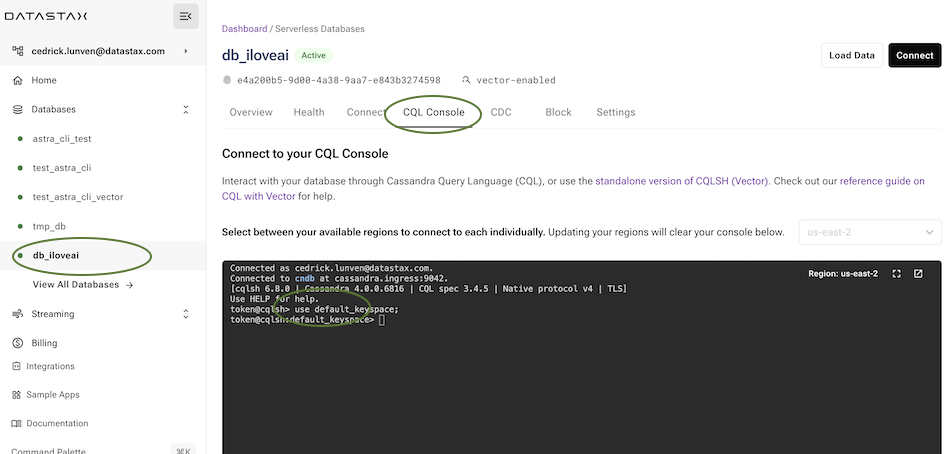

# Getting Started with Amazon BedRock and AstraDB

[](http://www.apache.org/licenses/LICENSE-2.0)
[](https://discord.com/widget?id=685554030159593522&theme=dark)

## 📋 Table of content


[**Part I - Amazon Bedrock**](#1-amazon-bedrock)
- [1.1 Chat Playground](#11---chat-playground)
- [1.2 Prompt Engineering](#12---prompt-engineering)
- [1.3 Text Playground](#13---text-playground)
- [1.4 Example Library](#14---examples-library)

[**Part II - Astra DB**](#2-astradb)
- [2.1 Create Astra Account](#21---create-your-datastax-astra-account)
- [2.2 Create a Vector database](#22---create-a-vector-database)
- [2.3 Create a token](#23---create-an-astra-token)
- [2.4 Semantic Search with CQL](#23---create-an-astra-token)

[**Part II - Retrieval Augmented generation**](#3-retrieval-augmented-generation)
- [3.1 - Overview](#31---overview)
- [3.2 - Prerequisites](#32---prerequisites)
- [3.3 - Run the notebook](#33---run-the-notebook)
- [3.4 - Check data in the database](#34---check-data-in-the-database)
- [3.5 - Cleanup](#35---cleanup)
- [3.6 - Additional Information](#36---additional-information)

<hr>

## 1. Amazon Bedrock

Amazon Bedrock is a fully managed, fully serverless service offering access to foundation models from various AI companies in a single API, together with additional capabilities such as facilities for fine-tuning and agent frameworks.

Amazon Bedrock aims at simplifying development, especially for Generative AI, while maintaining privacy and security. Experimenting with foundation models is easy, and models can be further customized in a privacy-aware fashion
within Bedrock.


### 1.1 - Chat Playground

- `✅ 1.1.a` - Connect to your `AWS Management Console` and look for service `Amazon Bedrock`


- `✅ 1.1.b` - On home page select Get started


- `✅ 1.1.c` - In the following tutorials we will be using the models `Claude V2` and `Titan`. To see what is available to you and ask for more model access the `Model Access` item in the menu.


- `✅ 1.1.d` - In the left hand side menu pick `Chat`

- `✅ 1.1.e` - Select model Provider and model

| Attribute | Value |
|-----------|-------|
| Provider  | Anthropic |
| Model     | Claude V2 |


- `✅ 1.1.f` - In the prompt enter the question and click `run`

```console
Explain me what Datastax Astra Vector is
```


- `✅ 1.1.g` - Above the prompt click `Update inference instruction` to check for a few options


### 1.2 - Prompt Engineering

- `✅ 1.2.a` - Start a new chat window with the `Start new chat`

- `✅ 1.2.b` - In the instructions provide the following block (few shot learning)

```
You are a text analyzer that need to tell me if the sentiment is positive or negative. Here a sample with results.text:I hated this movie
Sentiment: negative
Sentiment: positive
Text: most boring 90 minute of my life
Sentiment:negative
I will now give you some text and will repeat the process
```


- `✅ 1.2.c` - Validate the instructions and click `run`


- `✅ 1.2.d` - Start a a new chat and now try the following (Chain of thought)

```
When i was 6 my sister was half my age. Now I am 70. How old is my sister ?
```


### 1.3 - Text Playground

>  ℹ️ Note: Here's a comparison table that outlines the key differences between a Chat Model and a Language Model in the context of Large Language Models (LLMs):
>
>| Feature                | Chat Model                                  | Language Model                             |
>|------------------------|---------------------------------------------|--------------------------------------------|
>| Primary Function       | Engage in conversational dialogue           | Generate text based on input               |
>| Interactivity          | High, designed for back-and-forth exchange  | Varies, typically less interactive         |
>| Context Management     | Maintains context over a session            | Limited context retention                  |
>| Output                 | Tailored responses, can handle commands     | Broader text generation                    |
>| Training Objective     | Optimized for chat interaction              | Optimized for a wide range of text tasks   |
>| Use Cases              | Customer service, virtual assistants, etc.  | Content creation, summarization, etc.      |
>| Personalization        | Can adapt to user's style and preferences   | Less personalization                       |
>| Continuity             | Can reference previous dialogue             | May not reference earlier content as well  |
>| Response Length        | Typically shorter, conversational           | Can be longer and more detailed            |
>| Real-time Adaptation   | Can adjust to new topics in real-time       | Follows the prompt, less adaptive          |
>


- `✅ 1.3.a` - In the menu pick Playgrounds / Text


- `✅ 1.3.b` - Select model Provider and model

| Attribute | Value |
|-----------|-------|
| Provider  | Anthropic |
| Model     | Claude V2 |

- `✅ 1.3.c` - Enter the code and run

```
Write me a Cassandra CQL Statement to create a table and perform queries by user identifier
```


### 1.4 - Examples Library

- `✅ 1.4.a` - In the menu pick Getting Started / Examples


- `✅ 1.4.b` - Slect a model using Claude and select open in playground. Run the model.


<hr>

## 2. Astra DB through CQL

### 2.1 - Create your DataStax Astra account

> ℹ️ Account creation tutorial is available in [awesome astra](https://awesome-astra.github.io/docs/pages/astra/create-account/)


- `✅ 2.1.a` -  _click the image below or go to [https://astra.datastax./com](bit.ly/3QxhO6t)_

<a href="bit.ly/3QxhO6t">

</a>
<br/>

### 2.2 - Create a Vector Database

- `✅ 2.2.a` - Find the create database button


- `✅ 2.2.b` - Populate the create db form

| Attribute | Value |
|-----------|-------|
| Database Type  | Vector Database |
| Database Name  | `db_iloveai` |
| Keyspace Name  | `default_keyspace` |
| Cloud Provider  | `Amazon` |
| Region  | `us-east-2` |

- `✅ 2.2.c` - Click the `[Create Database]` button.


### 2.3 - Create an Astra Token

Wait for for the database to change status from _pending_ to active _active_.

- `✅ 2.3.a` - Select the connect TAB and click on Generate token

⚠️ ⚠️ ⚠️ Make sure to select the role `Database Administration`


- `✅ 2.3.b` - Save the token for later as a json file


The Token is in fact three separate strings: a `Client ID`, a `Client Secret` and the `token` proper. You will need some of these strings to access the database, depending on the type of access you plan. Although the Client ID, strictly speaking, is not a secret, you should regard this whole object as a secret and make sure not to share it inadvertently (e.g. committing it to a Git repository) as it grants access to your databases.

```json
{
  "ClientId": "ROkiiDZdvPOvHRSgoZtyAapp",
  "ClientSecret": "fakedfaked",
  "Token":"AstraCS:fake"
}
```

### 2.4 - Semantic Search with CQL

- `✅ 2.4.a` - Locate the tab `CQL Console` and open the CQL Console




- `✅ 2.4.b` - Select the keyspace we create `default_keyspace`

```console
USE default_keyspace;
```

- `✅ 2.4.c` -  Use this code to create a new table in your keyspace with a five-component vector column.

```sql
CREATE TABLE IF NOT EXISTS products (
 id int PRIMARY KEY,
 name TEXT,
 description TEXT,
 item_vector VECTOR<FLOAT, 5>
);
```

 - `✅ 2.4.d` - Create the custom index with Storage Attached Indexing (SAI). Creating the index and then loading the data avoids the concurrent building of the index as data loads.

```sql
CREATE CUSTOM INDEX IF NOT EXISTS ann_index
ON products(item_vector) USING 'StorageAttachedIndex';
```

- `✅ 2.4.e` - Insert sample data into the table using the new type.

```sql
INSERT INTO products (id, name, description, item_vector) VALUES (
1, //id
'Coded Cleats', //name
'ChatGPT integrated sneakers that talk to you', //description
[0.1, 0.15, 0.3, 0.12, 0.05] //item_vector
);
INSERT INTO products (id, name, description, item_vector)
VALUES (2, 'Logic Layers',
'An AI quilt to help you sleep forever',
[0.45, 0.09, 0.01, 0.2, 0.11]);
INSERT INTO products (id, name, description, item_vector)
VALUES (5, 'Vision Vector Frame',
'A deep learning display that controls your mood',
[0.1, 0.05, 0.08, 0.3, 0.6]);
```

- `✅ 2.4.f` -  Query vector data with CQL

To query data using Vector Search, use a SELECT query.

```sql
SELECT * FROM products
ORDER BY item_vector ANN OF [0.15, 0.1, 0.1, 0.35, 0.55]
LIMIT 1;
```

- `✅ 2.4.g` -  **Calculate the similarity**:  Calculate the similarity of the best scoring node in a vector query for ranking, filtering, user feedback, and system optimization in applications where similarity/relevance are crucial. This calculation helps you make informed decisions and enables algorithms to provide more tailored and accurate results.

```sql
SELECT description, similarity_cosine(item_vector, [0.1, 0.15, 0.3, 0.12, 0.05])
FROM products
ORDER BY item_vector ANN OF [0.1, 0.15, 0.3, 0.12, 0.05]
LIMIT 3;
```

<hr>

## 3. Retrieval Augmented generation

### 3.1 - Overview

In the following example, you will be able to run a standard RAG
(retrieval-augmented generation) application
that makes use of AI models from Amazon Bedrock and uses Astra DB as a Vector Store.

The integration is built with the LangChain framework, which conveniently offers
native support for Amazon Bedrock as well as Astra DB. Using LangChain is a popular
and well-established choice -- but certainly not the only one. See the references at
the end of the page for further options.

### 3.2 - Prerequisites

To run the integration demo notebook, you need:

- `✅` An **Amazon account** with access to Amazon Bedrock and Amazon SageMaker Studio. In particular, you will be asked to provide a set of credentials for programmatic access (i.e. `AWS_ACCESS_KEY_ID`, `AWS_SECRET_ACCESS_KEY` and `AWS_SESSION_TOKEN`);

- `✅` Alternatively, if you run the notebook from within SageMaker Studio, it is sufficient to add the Bedrock policy to your SageMaker role instead of explicitly providing the above secrets. Please refer to [this link](https://github.com/aws-samples/amazon-bedrock-workshop#enable-aws-iam-permissions-for-bedrock) for details.

- `✅`  An **Astra account** with a **Serverless Cassandra with Vector Search** database. You will need the [Database ID](https://awesome-astra.github.io/docs/pages/astra/faq/#where-should-i-find-a-database-identifier) and an [Access Token](https://awesome-astra.github.io/docs/pages/astra/create-token/) with role "Database Administrator".

### 3.3 - Run the notebook

The integration example is a Python 3.8+ runnable notebook. The **suggested method** is to import the notebook in your **Amazon SageMaker Studio** and run it from there on a standardized environment, which also makes the necessary AWS access credentials readily available. _As a side note, however, the code can be executed on any environment able to run Python notebooks._

<p align="center">
    <a href="https://github.com/datastaxdevs/demo-astra-db-amazon-bedrock/raw/main/notebooks/bedrock.ipynb" target="blank;">
        
    </a>
</p>

- `✅ 3.3.a` - Download the notebook from this repository at [this link](https://github.com/datastaxdevs/demo-astra-db-amazon-bedrock/raw/main/notebooks/bedrock.ipynb) and save it to your local computer.
(You can also view it [on your browser](https://github.com/datastaxdevs/demo-astra-db-amazon-bedrock/blob/main/notebooks/bedrock.ipynb).)


- `✅ 3.3.b` - Open your Amazon SageMaker console and click the "Studio" item in the left navbar. _Do not choose "Studio Lab", which is a different thing._


- `✅ 3.3.c` - Click the "Open Studio" button after choosing a user profile: this will bring you to the Studio interface. _You may need to create a Studio instance ("SageMaker domain") if you don't have one already._


- `✅ 3.3.d` - In the left toolbox of Sagemaker Studio, make sure you select the "File Browser" view and locate the "Upload" button: use it to upload the notebook file you previously saved. The notebook will be shown in the file browser.


- `✅ 3.3.e` - If you double-click on it, the notebook will be opened in Studio. In order to run it, you will be asked to start a "notebook environment" (essentially, a Python runtime). Choose the "Data Science 3.0" image and a "Python 3" kernel and hit "Select".


- `✅ 3.3.f` - Once the kernel has fully started, you can run each cell in sequence by clicking on them and pressing Shift+Enter. You will be asked for the secrets during execution.


```
who die first romeo or Astra ?
```

### 3.4 - Check data in the database

- `✅ 3.4.a` - Locate the tab `CQL Console` again and open the CQL Console


- `✅ 3.4.b` - Validate that the database is created 

```sql
use default_keyspace;
describe tables;
describe table shakespeare_act5;
```

- `✅ 3.4.c` - Count records after import

```sql
clear
select count(*) from shakespeare_act5;
```

- `✅ 3.4.d` - Show content of the table

```
select row_id,attributes_blob,body_blob,metadata_s from shakespeare_act5 limit 3;
```

### 3.5 - Cleanup

During the above steps, some resources are created, which you may want to
cleanly dispose of after you are done.

These have been stared to run the notebook itself. You can shut them down from within SageMaker Studio:
select the "Running Terminals and Kernels" view on the left toolbar (see picture below) and click the "shut down" icon next to all instances, apps and sessions associated to the notebook you just ran.


### 3.6 - Additional Information

[More info on Amazon Bedrock](https://docs.aws.amazon.com/bedrock/latest/userguide/what-is-bedrock.html)

[Accessing Amazon Bedrock from Python](https://github.com/aws-samples/amazon-bedrock-samples/tree/main/introduction-to-bedrock)

[Using Astra DB for your Generative AI applications](https://awesome-astra.github.io/docs/pages/aiml/)